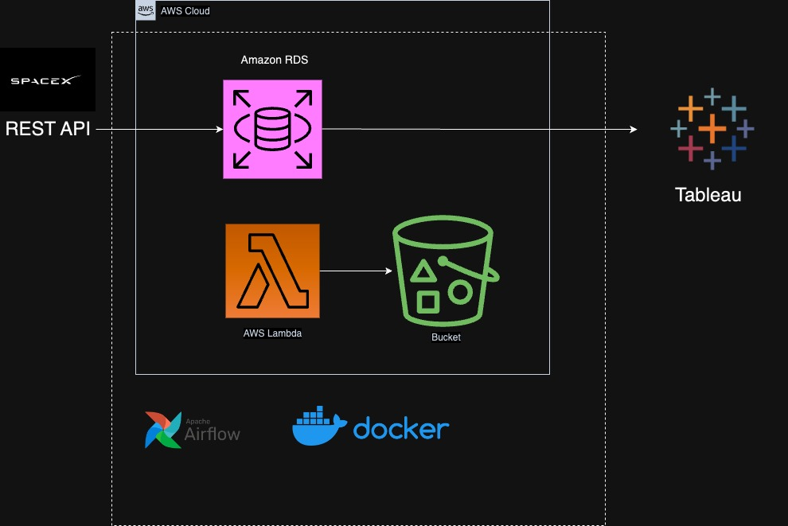

# Summary
This is an ETL pipeline that fetches rocket and launch mission data from SpaceX REST API, and saves that data in Amazon RDS. This pipeline is orchestrated through Apache Airflow running on Docker. The data users then apply further image processing and data visualization using Tableau and AWS Lambda functions. 

# Setting Up Airflow:
Follow Documentation provided in https://airflow.apache.org/docs/apache-airflow/stable/howto/docker-compose/index.html 

docker compose up airflow-init

docker compose up -d

docker-compose down -v

# System Design

